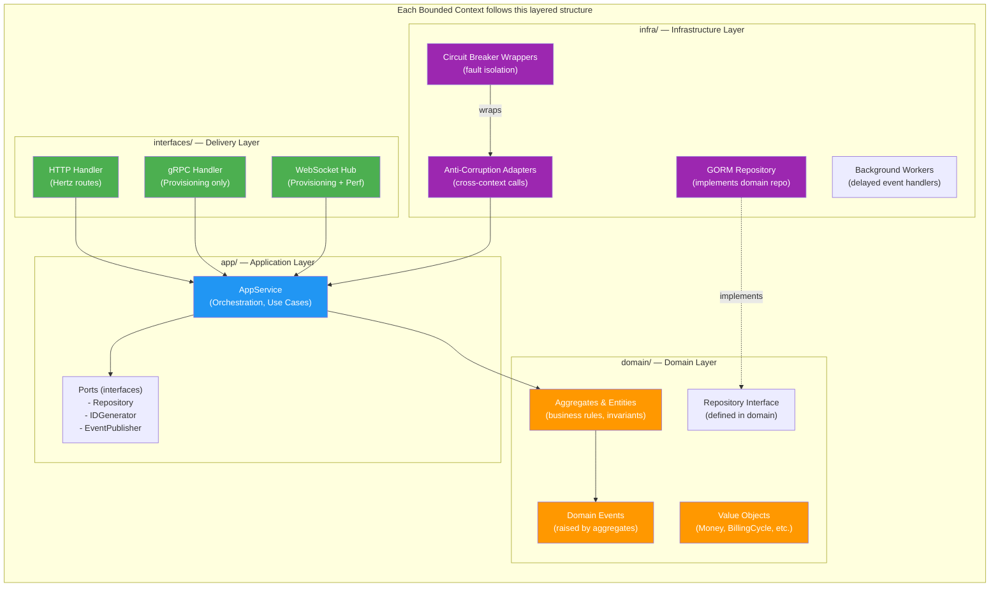
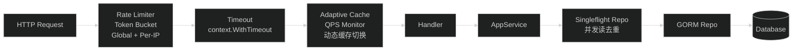
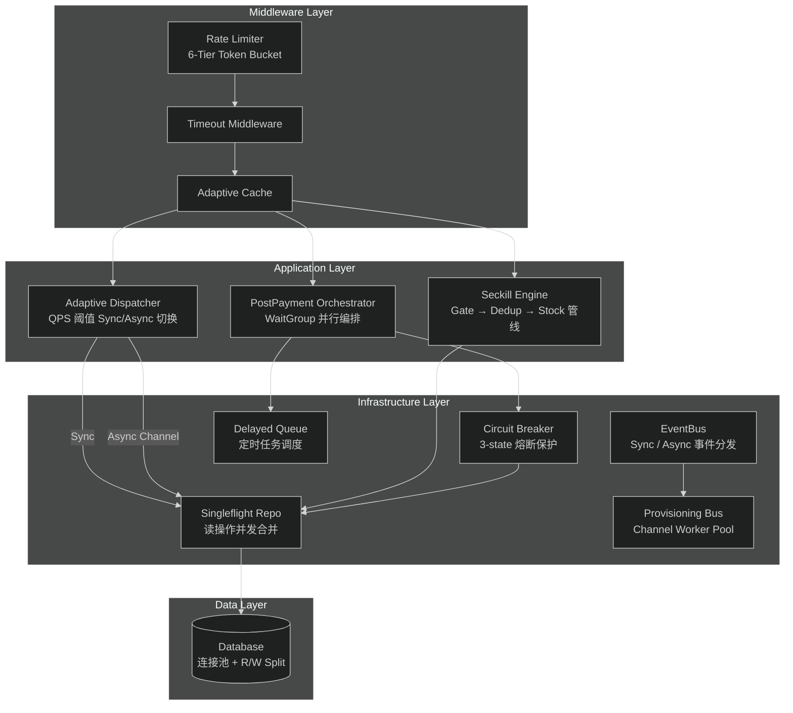
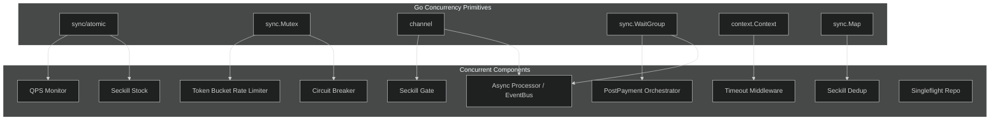
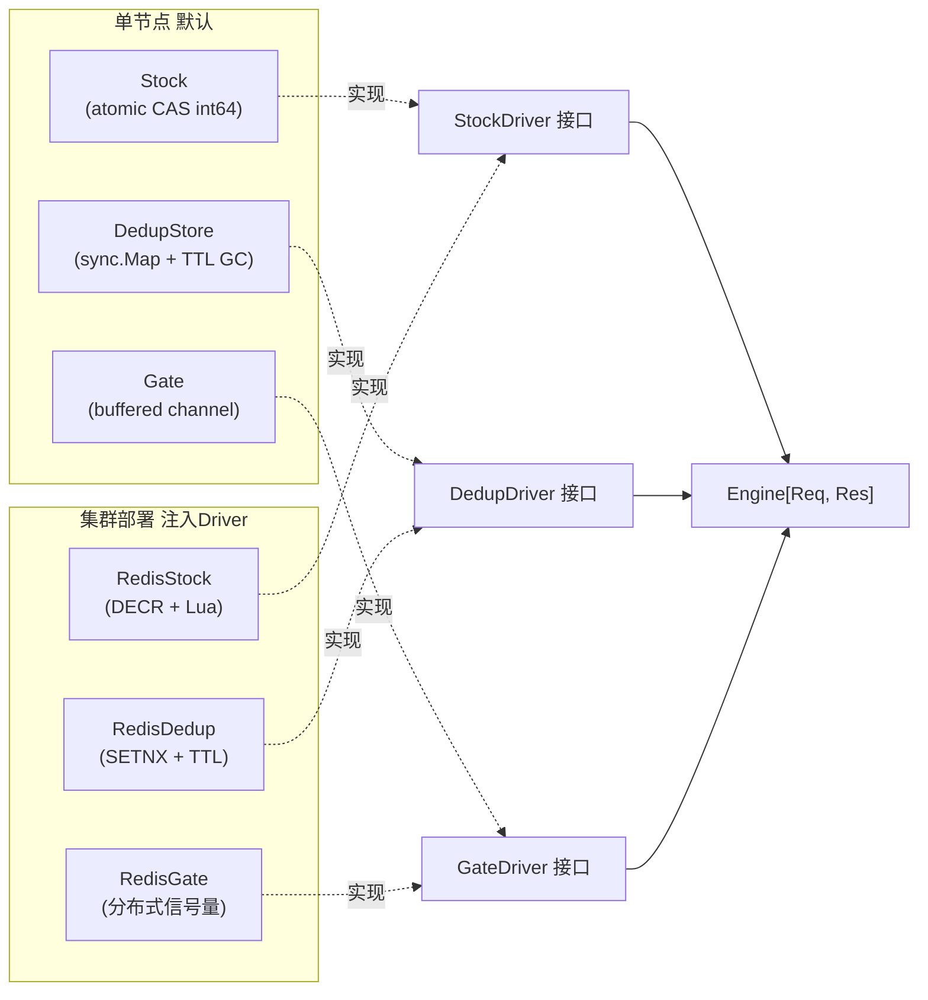
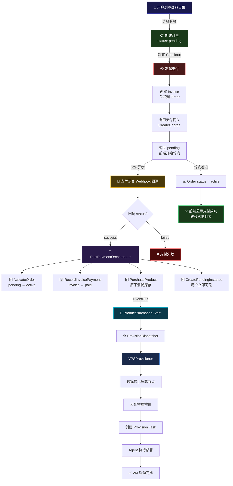

# Celeris主机平台


## 序
目前主机平台一眼看过去都是whmcs, 虽然稳定，但是并发很差

**包括但不限于下面的逻辑**
- 一遇到大流量，直接连接数一高直接打死数据库
- 母鸡同时并发开机直接爆母鸡
- 邮件系统卡死导致占用连接
- 下单的时候还要去查询母鸡是否占用某个主机名
- 最重要的是不是开源，拓展强烈依赖插件接口，无原生源码，难以拓展
- PHP


等等这些逻辑，都表明whmcs作为一个云计算主机管理平台，已经是过时的架构，因此我写了这个项目


项目优势：
- golang，可以编译成二进制，编译简单部署简单，gmp很轻量，原生就能承载很大流量
- 拓展包方便，成熟，如本项目直接使用了字节的hertz加强epoll，并且使用字节的sonic包优化json反序列
- 单机/集群可拓展架构，单机sqlite就能承载读+写约4296RPS，见后文测试
- ddd架构，接口高度解耦，方便更换消息队列/redis/数据库，代码易修改不史山
- 参照了主流的并发设计，包括但不限于自适应动态同步/异步，缓存提升，令牌桶限流，熔断降级，singleflight, 异步事件分发，接口优先级策略

### 为什么whmcs并发差
whmcs基于传统php-fpm设计，PHP-FPM 的 进程-请求一一对应模型（one process per request） 使得系统资源（内存、连接、文件描述符）消耗与并发请求数线性增长，缺乏复用机制

说人话就是，每一个请求，都对应一个数据库连接，当请求数增长，数据库/系统无法处理对应连接的请求创建的进程时，就会出现并发问题

php-fpm相比较go的gmp，有天然的劣势

**那这样的话，是否可以换个框架？比如Swoole或者RoadRunner呢**

如果whmcs是开源的，可以修改代码，则切换框架是可行的，但受限于whmcs闭源，若想替换成Swoole或者RoadRunner，理论上是不太可行的方案

Swoole/RoadRunner 要求应用必须是**长进程安全（long-running safe）**的：

- 不能用 PHP 全局变量/超全局变量（$_POST, $_SERVER, $_SESSION）跨请求污染
- 不能有请求间共享的静态状态
- 数据库连接必须显式管理生命周期

WHMCS 是按传统 PHP 请求生命周期设计的，大量依赖这些模式。强行跑 Swoole 会出现：
- 请求间数据污染（上一个用户的数据泄露到下一个）
- 内存泄漏（对象不被销毁）
- ionCube 加密文件与 Swoole 协程的兼容性问题

假设最大worker数量设置为1000，真的有1000个请求进来，那数据库那边就要开1000个连接，这显然数据库层就会撑不住，数据库就会让这些连接先阻塞排队，导致并发问题

综上所述，即便是调教得再好的php-fpm, 也无法天然承载大流量，也就出现了用户流量一大就卡的现象
### 为什么go？

#### GMP模型
说到go就不得不说gmp模型了

go的gmp模型是一个让人不得不佩服的设计, 主要的概念如下

```
G: goroutine
M: mechine
P: processor
```

**用我自己的话说一次调度流程**

1. 程序启动，创建若干个P（一般是等于cpu核心数），创建第一个M，启动主协程第一个G放入**当前P**中等待调度
2. 向操作系统申请M，绑定P, 然后M开始循环执行schedule
3. schedule首先查有没有饿死（61次调度去拿G），接下来让目前拥有P的M按照优先级跑G的逻辑，从本地队列、全局队列、查网络轮询器（有netpoll的时候）、偷别的P队列
4. M找到G以后，可能有以下情况：可能会正常结束，可能会产生系统调用（此时M会和P解绑，P给另一个M，自身阻塞，等待系统调用结束后会尝试获取P），可能会被网络io阻塞（netpoll），可能会因为执行时间过长被抢占


**为什么go强？**

- GMP模型可以让每个协程都能获得平均的运行时间（抢占+窃取）
- netpoll天然的epoll逻辑，使得处理网络io有得天独厚的优势
- G很轻量，启一个G只有2KB左右的占用，不需要拷贝上下文，由P管理
- M和P可以动态解绑，G不会因为频繁系统调用饿死或者创建过多的线程，不同线程的竞争队列几乎没有

#### 比较同类型语言
**比较java**

java原生处理网络io，若不使用java21用轻量的virtual thread, 将会一个网络请求对应一个线程，创建运行开销大，若使用Reactor模型，异步难以调试问题

而go则结合了异步和同步的两者优点，既原生支持非阻塞代码，又便于调试维护

**比较php**

php8.4虽然已经算是很快的，但解释语言，意味着性能仍然取决于解释器性能和调优，且环境部署复杂

go则可以单文件二进制直接部署，不需要任何依赖，运行速度接近C++


### 项目定位
本项目强调可拓展，易于部署，高并发可用，针对中小型IDC优化，既可以纵向拓展到大型重量级部署环境，也可以横向直接拓展集群，集成vps售卖/管理完整逻辑


## 设计思路

在刚开始的时候，我规划的蓝图很大，想把虚拟机的整个生命周期管理也写进去，也想把整个whmcs的无缝迁移工具也写进去，但这样看代码会膨胀很多，而且作为开发者，我必须要在有限的时间内实现对应主题的功能，我的主题是**并发系统**, 那么我就只做并发即可

### mvc和ddd的架构权衡
一般标准架构是mvc，但mvc写的话可能会遇到一个问题，serivce某个方法如果要添加项目逻辑，需要直接在那个service的方法里面写，这样就会导致service代码块可能会及其膨大，你可能会看到一个方法里面有几万行，根本不敢乱改动

在我的项目中，我选择了DDD模型，DDD模型采用充血模型，会把业务逻辑直接写在底层domain对象中，**service层只管编排就行**，根本不需要管底层是怎么做的

如果需要拓展逻辑，比如 `购买产品上下文`中的`user domain`，添加一个`折扣码`的功能，在ddd中你只需要修改 `产品` domain 下的user实体； 如果用的是mvc模型，就要在service加一行，如此滚雪球，service将会越来越大

ddd好处说完了，坏处呢？

ddd在刚开发的时候，难以界定上下文边界，容易出现service跨domain直接调度的问题，会导致代码腐化，回落成史山代码，一个domain里面参杂多种逻辑

说白了就是，**起步的时候很复杂，但后期维护很方便**

对于主机平台这种架构，天生就是很复杂的，与其用mvc，不如一开始复杂，后期维护舒服，随时可拆分：每个限界上下文有独立的 domain/app/infra/interfaces 四层



主要架构思路：按业务分domain上下文, 8 个限界上下文各自职责

`identity` — 用户认证（JWT + bcrypt）、RBAC 角色管理
`catalog` — 产品目录管理、库存控制、Singleflight 缓存合并
`ordering` — 订单生命周期状态机（pending→active→suspended→cancelled→terminated）
`payment` — 支付网关抽象、PostPaymentOrchestrator 跨域编排
`billing` — 发票领域模型（Draft→Issued→Paid→Void）、账单周期
`instance` — 虚拟机实例管理、Channel-based 异步开通队列
`provisioning` — 宿主机节点、IP池、资源池、区域、gRPC Agent 通信
`checkout` — 统一下单入口、自适应 Sync/Async 切换

### 并发架构落地
在并发实现中，我设计了多个抗并发的中间件，并使用高效的并发包及golang自带的并发原语

**关键实现如下**

- Checkout 根据qps检测，切换支付的同步/异步
- Seckill 秒杀管线
- TokenBucket 双层令牌桶分层限流api
- qps检测的Adaptive Cache 动态缓存
- singleflight防止大量读请求击穿数据库
- 熔断器分层api保护数据库
- eventbus异步开机

#### Celeris 并发组件架构图

##### 图 1：中间件到 Singleflight 请求处理链路



##### 图 2：并发组件架构总览



##### 图 3：关键并发原语与组件映射



接下来将分层说明并发组件以及为什么要这样设计

#### checkout 200/202 设计

结账的时候的200方案，是最直接的方案，后端返回200，用户可以直接跳转到支付页面，付款成功，此方案是最标准的 **(同步)** 方案

但这里必须得思考一个问题：假设此时请求流量过大，数据库io卡死了，你的service层挂起等待返回结果，前端也要卡在这等待，那给客户的反馈体验不就差很多了吗

于是就引入了结账的202方案，返回正在处理，前端需要轮询/开个ws查看是否下单成功，再跳转到支付页面 **（异步）** 方案，这样，即便在后端忙的时候，可以让用户提前得到反馈，虽然可能会慢了一点或者返回失败，但这样至少后端压力没那么大

| 比较维度 | HTTP 200 (OK) - 同步结账 | HTTP 202 (Accepted) - 异步结账 |
| :--- | :--- | :--- |
| **处理模式** | **同步处理**。服务器处理完所有逻辑（扣减库存、创建订单、调用支付网关等）后才返回。 | **异步处理**。服务器仅做基础校验（如参数合法性），将请求丢入消息队列后立即返回。 |
| **响应时间** | **长**。响应时间等于所有依赖服务处理时间的总和，容易发生超时。 | **极短**。通常在几十毫秒内返回，用户感知极快。 |
| **用户体验** | **明确但需等待**。前端显示 Loading 转圈，一旦返回，用户立刻知道最终结果（成功或失败）。 | **流畅但需轮询**。瞬间跳转“订单处理中”页面，前端需通过轮询 (Polling) 或 WebSocket 获取最终状态。 |
| **高并发与扩展性** | **较弱**。高并发下，长时间的阻塞会导致服务器线程池/连接数耗尽，系统容易雪崩。 | **极强**。通过消息队列（如 Kafka/RabbitMQ）实现“削峰填谷”，系统吞吐量大幅提升。 |
| **架构复杂度** | **低**。典型的 Request-Response 模型，易于开发、测试和追踪调试。 | **高**。引入了中间件，需要处理消息防重、丢失补偿、最终一致性以及前端的轮询逻辑。 |
| **错误反馈时效** | **即时**。如遇到库存不足或支付拒绝，前端可以直接向用户展示具体的报错提示。 | **滞后**。如果后台处理时发现失败，需要通过 App 推送、短信或站内信通知用户。 |
| **典型适用场景** | 访问量平稳的中小型电商、B2B 内部交易系统、对实时性要求极高的虚拟商品发货。 | **秒杀大促 (Flash Sales)**、调用第三方支付/风控接口极慢的场景、大型微服务电商平台。 |


**关键在于，api层怎么知道后端压力大不大呢？你总不能直接某个商品写死200或者202吧**

这就引入了**动态qps监控的设计**，只需要在后端写一个中间件，计算每秒的qps，大于某个阈值，自动升级成202，前端只需要根据后端status code判断后就行了

还有一个小细节，如果升级后202开ws轮询的话，还是会对后端数据库造成开销，接下来就到了浏览器新特性，**SSE登场的时候啦**

SSE是浏览器主动发起的长连接，浏览器监听此接口，但不发送任何数据，只有在后端完成，主动推送数据的时候，做出event响应。这就把消耗从n个请求，降低到了0

**最终实现如下**
`pkg/adaptive/cache_middleware.go` 实现了基于 QPS 的动态内存缓存，和 QPS Monitor + 202 Dispatcher 是同一套系统的三件套，低 QPS 时不缓存（数据新鲜），高 QPS 时自动缓存热点数据（保护数据库） 的设计逻辑

#### Token Bucket 令牌桶限流
在实际生产环境中，难免会遇到爬虫等恶意流量刷流，这部分是底层数据库绝对不应该收到的，但也不是每个接口都会受到这样的恶意流量，若所有接口都应用token bucket，会导致不该防御的防住，该防御的也不到位

所以，所有api我采用了分层设计的令牌桶限流
- **分层设计**
    - Baseline（全局安全网）、Critical（目录浏览）、Checkout（下单支付）同层，必须严格限制
    - Auth（登录注册，严格防暴力破解）、Standard（一般业务）、Admin（管理后台），稍微宽松
    - Agent 心跳和支付 Webhook 故意不限流（丢失代价太高）

- **实现要点**
  - 惰性补充（lazy refill）：不需要后台 goroutine，`Allow()` 时按时间差计算补充量
  - `sync.Mutex` 保护令牌计数器——简单正确，临界区极短（几个浮点运算）
  - 每个限流器独立实例，不同级别互不影响

#### 布隆过滤器
- **问题**：同上面Token Bucket中分析的，可能会遇到爬虫恶意刷流的流量，通到了数据库层，查询根本不存在的请求，这叫`缓存穿透`问题

缓存穿透（Cache Penetration）是分布式系统中一个经典的性能和稳定性问题。它是指用户查询的数据既不在缓存中，也不在数据库中由于缓存没命中，请求会直接打到数据库；而数据库也查不到，自然无法更新缓存。这就导致每一次针对该数据的查询都会直接穿透缓存，冲击数据库。

- **方案**：添加布隆过滤器，布隆过滤器是哈希算法实现
    - 如果请求经过哈希，结果为不存在，则一定不存在数据库，过滤该非法请求；
    - 若布隆过滤器说存在，则有可能存在，放行请求

**实现**

`pkg/bloom/bloom.go` 抽象为一个通用的布隆过滤器，使用两个哈希（FNV-1a和FNV-1）计算，用sync.RWMutex + 原子自增锁提高并发，最小化引入布隆带来的并发延迟
```pkg/bloom/bloom.go
func (f *Filter) Add(key string) {
	h1, h2 := f.hash(key)

	f.mu.Lock()
	
	// 改位图
	for i := uint64(0); i < f.k; i++ {
		pos := (h1 + i*h2) % f.m
		wordIdx := pos / 64
		bitIdx := pos % 64
		f.bits[wordIdx] |= 1 << bitIdx
	}
	
	// 直接解锁了
	f.mu.Unlock()
    
    // CAS自增，用cpu内部指令运算
	atomic.AddInt64(&f.count, 1)
}
```

在实际使用的时候，抽象了一个`internal/catalog/infra/bloom_repo.go`实现了 GORM Repo，将实际repo注入到wrapper中作为inner, 这样便可以在不改动源代码的情况下使用，只需要在编排注入的时候更换成bloom_repo即可


#### Circuit Breaker 熔断降级
我的ddd架构是用的一个统一调度器处理下单逻辑，这种方案虽然解耦，但如果下游一个服务被打死无法响应，就会导致一连串服务都卡死不能用

这种解决方法是可以每隔调度模块，包装一个独立的熔断器

- **方案**：每个跨模块 Adapter 包装一个独立熔断器
  - 5 处熔断器：`pay-ordering`、`pay-catalog`、`pay-instance`、`pay-billing`、`node-capacity`
  - 三态转换：Closed → Open（连续 N 次失败）→ HalfOpen（超时后探测）→ Closed（恢复）
- **实现要点**
  - Go 泛型 `Execute[T any](cb, fn)` — 零 boilerplate 包装任意调用
  - `sync.Mutex` 保护状态机——安全且简洁
  - Open 状态直接返回 `ErrCircuitOpen`，不调用下游，快速失败

当流量大的时候，关键接口直接快速失败，不占用任何数据库资源，次要接口直接读取缓存，这样可以保证局部可用性

#### Singleflight 缓存合并
- **问题**：热门产品页面，100 个并发请求同时查数据库，99 个是浪费的
- **方案**：`SingleflightProductRepo` 装饰器包装 `GormProductRepo`
  - 相同产品 ID 的并发查询只执行一次 DB 查询，其余阻塞等待结果共享
  - 使用 `golang.org/x/sync/singleflight`
- **为什么不直接用 Redis 缓存？**
  - 单实例场景下 singleflight 更轻量，零外部依赖
  - 配合 adaptive cache middleware，高 QPS 时自动启用内存缓存

### #EventBus 进程内事件总线
- **问题**：限界上下文之间需要解耦通信
- **方案**：同步事件总线 + 延迟事件发布器
  - 同步 EventBus：`Subscribe(eventName, handler)` + `Publish(event)` — `sync.RWMutex` 保护
  - Delayed Publisher：支持 InMemory（开发）和 Asynq/Redis（生产）两种实现
  - 例如：`ProductPurchased` 事件触发 `VPSProvisioner` 创建开通任务
- **为什么同步总线？**
  - 模块化单体中，事务一致性比吞吐量更重要
  - 所有 handler 在同一个调用栈执行，出错可以直接回滚
  - 当并发上升，**自动适配异步逻辑**

用法：`internal/instance/infra/channel_provisioning_bus.go`中的开机队列，单机使用chan缓冲任务队列，开一个消费者goroutine，异步控制开机的并发量，防止冲垮母鸡，集群则是预留接口，方便拓展至生产MQ/redis MQ 

#### timeout context 包装器

```mermaid
graph TD                                                                                                                                                                                                                          
      subgraph pkg/timeout                                                                                                                                                                                                          
          MW["Middleware(duration)"]                                                                                                                                                                                                
          FR["ForRoutes(duration)"]                                                                                                                                                                                                 
          FR --> MW                                                                                                                                                                                                                 
          MW --> |"spawns goroutine"| HC["Handler Chain\nctx.Next(timeoutCtx)"]                                                                                                                                                     
          MW --> |"select"| D{done?}                                                                                                                                                                                                
          HC --> |"completed"| D                                                                                                                                                                                                    
          D --> |"handler finished"| OK["200 Normal Response"]                                                                                                                                                                      
          D --> |"deadline exceeded"| T504["504 Gateway Timeout\nctx.Abort()"]                                                                                                                                                      
      end                                                                                                                                                                                                                           
                                                                                                                                                                                                                                    
      subgraph internal/api/config                                                                                                                                                                                                  
          CFG["Config"]
          CFG --> DB["DatabaseConfig\ndriver / DSN / pool\nReplicaDSNs"]                                                                                                                                                            
          CFG --> JWT["JWTConfig\nsecret / issuer"]                                                                                                                                                                                 
          CFG --> GRPC["GRPCConfig\nlisten addr"]
          CFG --> RL["RateLimitConfig"]                                                                                                                                                                                             
          RL --> T1["Baseline\n5000 / 50 QPS"]
          RL --> T2["Critical\n2000 / 30 QPS"]                                                                                                                                                                                      
          RL --> T3["Checkout\n1000 / 5 QPS"]
          RL --> T4["Auth\n500 / 3 QPS"]                                                                                                                                                                                            
          RL --> T5["Standard\n1000 / 15 QPS"]                                                                                                                                                                                      
          RL --> T6["Admin\n0 / 20 QPS"]                                                                                                                                                                                            
                                                                                                                                                                                                                                    
          DEF["DefaultConfig()"] --> CFG                                                                                                                                                                                            
          LFF["LoadFromFile(path)"] --> |"YAML override"| CFG                                                                                                                                                                       
      end                                                                                                                                                                                                                           
                  
      MW -.->|"applied via config tiers"| RL 
```


作为一个常规go程序，ctx是一个比较重要又普通的实现，每个api应该合理分配超时时间，是防止慢请求耗尽连接池的基础组件

#### seckill组件

既然是并发，就少不了我们大厂最爱聊的秒杀环节了，**这一部分主要叙述如何应对极端大流量场景，但很多关键接口其实都通用的，这一部分也会介绍常见的应对方法**

首先说理论模型

**在秒杀这种极限场景下，必须把接口层层保护，这就是常说的漏斗模型**

1. 先用jwt校验/签名等，把关键的接口保护起来，过滤掉爬虫等非法流量
2. 限制ip/userid的请求次数，基于令牌桶的限流，关键接口严格限制次数
3. 用布隆过滤器，过滤掉非法请求流量，因为布隆过滤器说不存在，就直接返回了，根本不会打到数据库
4. 到了这一层，流量已经很少了，这里就可以写我们关键的接口逻辑

**业务接口部分**

1. **动静分离**，cdn层直接把静态资源分流掉，不要打到后端占用流量资源
2. **可以下放业务逻辑到nginx**，内存直接缓存库存状态，或者用lua直接过滤缓解掉一部分请求，不打到redis上，或者lua配合redis/MQ减少链路长度，这一层nginx也可以顺便做上面的说的ip/请求限流
3. **关键数据预热**，库存直接拉到redis中，用lua原子更新库存，逻辑在redis直接打回去，并且大部分请求都只是读而不是写，在高峰请求时，读/写数据比可以高达100：1，不要让读打到数据库层
4. **读写分离数据库**，把读请求路由到一个单独的数据库节点/集群承载流量，而写请求则写主库
5. **业务接口代码操作数据库的时候用原子更新**，这样库存不会出现多次扣减的情况，防止竞态（读改写）多连接等待锁直接卡死，虽说性能一般，适当取舍
6. 如果还是实在扛不住，就横向拓展一个MQ+数据库嘛，再怎么说也不能违反物理学定律，单机IO就那么点，不能强人所难嘛
7. 具体的业务流程中不要开长事务等等，已经说腻了

我在项目里如何做的？

由于我是个单应用项目，上面除了nginx，我都考虑到了，基本全部实现落地，单机模式用的是 sync/atomic.CompareAndSwapInt64 (CAS循环)，集群模式下使用Redis Lua 更新库存

主要流程为： Gate → Dedup → Stock → Execute → Hooks



先预热（限流一定请求数量inflight），然后放 inflight数量进来，后面请求全拒绝，接着排队dedup防重复订单，stock执行快速扣减库存，放到execute后续逻辑，为了方便拓展，单机我采用了内存部署，不需要redis，集群配置的则上升到redis，修改集群或者单机模式只需要配置driver后注入

### 业务流程链路 订单→支付→开通

#### 架构图总览



- **涉及的 Bounded Contexts 关键链路解释**

| Context | 职责 | 关键文件 |
|---------|------|----------|
| **Catalog** | 商品目录、库存管理、发布 ProductPurchasedEvent | `internal/catalog/app/product_app.go` |
| **Ordering** | 订单生命周期 (pending→active→suspended→terminated) | `internal/ordering/app/order_app.go` |
| **Billing** | Invoice 创建、发行、付款记录、作废 | `internal/billing/app/invoice_app.go` |
| **Payment** | 支付网关对接、charge 创建、webhook 处理 | `internal/payment/app/payment_app.go` |
| **PostPayment Orchestrator** | 跨域编排：激活订单 + 记录付款 + 消耗库存 + 创建实例 | `internal/payment/app/post_payment_orchestrator.go` |
| **Provisioning** | 资源池管理、节点选择、物理部署任务创建 | `internal/provisioning/app/provision_dispatcher.go` |
| **Instance** | 实例 CRUD、状态管理 (pending→running→stopped) | `internal/instance/app/` |
| **Frontend** | Vue SPA: NewInstanceView → CheckoutView → 轮询确认 | `frontend/src/views/` |

#### 实际流程
1. 用户选择产品 → `POST /checkout` → 创建订单（pending）
2. 用户发起支付 → `POST /orders/:id/pay`
  - PostPaymentOrchestrator 创建发票（Draft→Issued）
  - 调用支付网关创建 charge
  - 调度延迟事件 `invoice.check_timeout`（15分钟后检查是否超时）
3. 支付网关回调 → `POST /payments/webhook`
  - PostPaymentOrchestrator.HandlePaymentConfirmed：
    - 激活订单（pending→active）
    - 记录发票支付（Issued→Paid）
    - **并行执行**：消费产品库存 + 创建待开通实例（`sync.WaitGroup`）
    - 产品消费触发 `ProductPurchased` 事件 → `VPSProvisioner` 创建开通任务
4. 如果超时未支付 → InvoiceTimeoutWorker 作废发票 + 取消订单

#### **跨域编排的设计哲学**
ddd架构一个比较头疼的问题是，如何用一个上帝编排域，调度所有域，而不过度耦合代码，同时不过度设计

从我的项目架构实际流程看，我需要处理 `产品、下单、支付、创建` 四个域的逻辑，为了权衡架构设计，我选择直接在payment里面用`post_payment_orchestrator`编排调度下单后所有接口，因为目前并没有其他触发order的触发点

我引入了接口
```
type OrderActivator interface { ... }     // 对 ordering 的端口
type ProductPurchaser interface { ... }    // 对 catalog 的端口
type InstanceCreator interface { ... }     // 对 instance 的端口
type InvoiceCreator interface { ... }      // 对 billing 的端口
```

在不过度设计的同时，保留了可以拓展的空间，并且抽象接口，不产生史山依赖 ，infra 层实现 Adapter，并为每个 Adapter 包裹熔断器，编排时我还使用了并行策略，减少支付延迟

- **容错策略**
  - 订单激活是关键路径，失败直接返回错误
  - 发票记录、库存消费、实例创建是非关键路径，失败只 log 不回滚
  - 发票超时：延迟事件兜底，幂等检查（已支付则 no-op）


